## Module 1 - Getting Started

### <ins>Crea tu primera página HTML</ins>

- Crea una carpeta `app` en tu ordenador  
- Crea una página llamada `index.html` dentro de la carpeta `app` en tu ordenador Abre esa página en tu editor de texto favorito
	- Yo personalmente uso VSCode

### <ins>Escriba el siguiente código `boilerplate` en el archivo `index.html`</ins>

- Este es su código HTML boilerplate  
- Le está diciendo al navegador que index.html es un archivo HTML y que lo renderice como un sitio web HTML. 
- La etiqueta `head` es donde se declaran los metadatos, el título y se enlazan los archivos de estilo.  
- La etiqueta `body` es donde se empieza a escribir el código de la página web.
	- La parte visible del documento HTML se encuentra entre `<body>` y `</body>`. 
- La etiqueta `title` se utiliza para dar título a la página.
- La etiqueta `h1` se utiliza para mostrar un título en la página.

```html
<!DOCTYPE html>
<html>

  <head>
    <title>My First HTML Page</title>

  </head>
  <body>

    <h1>My First Web Page</h1>
  </body>

</html>
```


### <ins>Ejecute su primer archivo HTML</ins>

- Para ejecutar su aplicación localmente   
    - Guarde los cambios en la página `index.html`.  
    - A continuación, abra implícitamente su archivo `index.html` en el navegador

### <ins>Ejecutar la aplicación en Internet GRATIS</ins>

- Si quieres ejecutar tu aplicación en Internet y compartir la URL con tu socio sigue estos pasos  
- Ve a [Netlify Drop](https://app.netlify.com/drop)
- Suelta la carpeta que contiene tu HTML y CSS le (si tienes una) en esa página donde dice `Arrastra y suelta la carpeta de tu sitio aquí`.
- Y ¡voilá! Se creará una URL única que podrás compartir con tu socio.

> Puedes ver el ejemplo [aquí](https://happy-ramanujan-9ca090.netlify.app)

**¡Si no escribo `<! DOCTYPE html>` ¿funcionará HTML5?**

- No, el navegador no podrá identificar que se trata de un documento HTML y las etiquetas HTML 5 no funcionarán correctamente.  
- Los navegadores modernos son lo suficientemente inteligentes como para renderizar el contenido HTML, pero puede que no esté optimizado correctamente.

**DOM**

- El documento HTML se representa como un árbol 
- Cada nodo del árbol es un objeto  
- El objeto `document` representa el árbol DOM
- El nodo `<html>` está en la raíz
- `<head>` y `<body>` son sus hijos
- Los nodos hoja contienen el texto del documento  
- "My Application", "This is title", y "This is link" son los nodos hoja.  
- La api DOM está disponible para capturar eventos de usuario y dar acceso a sus hijos

> NOTA: Si ponemos algo después de la etiqueta final `</body>`, entonces eso se mueve automáticamente dentro del cuerpo, al final, ya que la especificación HTML requiere que todo el contenido debe estar dentro de `<body>`.

> NOTA: Los navegadores modernos son inteligentes. Si el navegador encuentra HTML malformado, lo corrige automáticamente al hacer el DOM. Por ejemplo: el navegador insertará automáticamente la etiqueta `<html>` en la parte superior si no se proporciona.

### <ins>When should you use section, div or article?</ins>

**section**
+ Agrupar contenidos con un único tema relacionado 
+ Como una subsección de un artículo largo 
+ Normalmente tiene encabezamiento y pie de página
```html
<section>
	<h2>Subtitle</h2>
	<p>My long paragraph</p>
</section>
```
**article**
- Representa el contenido completo y autónomo de una página. 
- Puede ser una entrada de foro, un artículo de periódico, una entrada de blog 
- Su contenido independiente  
- Tiene sentido por sí mismo
```html
<article>
	<h2>Subtitle</h2>
	<p>My long paragraph</p>
</article>
```

**div**
- No transmite ningún significado  
- Suele denominarse elemento de último recurso 
- Se utiliza cuando ningún otro elemento es adecuado
```html 
<div>
  <h2>Subtitle</h2>
  <p>My long paragraph</p>
</div>
```
**Headings**
- Las etiquetas Heading forman parte del HTML semántico  
- Se utilizan para dene encabezados  
- Van de `h1` a `h6`  
- El tamaño por defecto es el mayor para `h1` y el menor para `h6`
```html
<h1>My Heading 1</h1>
<h2>My Heading 2</h2>
<h3>My Heading 3</h3>
<h4>My Heading 4</h4>
<h5>My Heading 5</h5>
<h6>My Heading 6</h6>
```

- Los encabezados se utilizan con fines de SEO  
    - Optimización para motores de búsqueda  
    - Útiles para indexar páginas y la estructura de la página  
- Puede dar formato a los estilos de fuente según sus necesidades para estas etiquetas

```html 
<h1 style="font-size:72px;">My Heading</h1>
```

**Paragraph**
- El elemento `p` se utiliza para escribir un párrafo de texto en HTML.  
- Puede incluir p dentro de otros elementos como div, section, article

> CONSEJO: no añada espacios en blanco adicionales - el navegador eliminará los espacios y líneas sobrantes cuando se muestre la página. Utiliza otras propiedades HTML y CSS para añadir espacios en blanco según tus necesidades.

```html
<div>
  <p style="font-size:12px;">This is a paragraph.</p>
</div>
```

**Links / Anchor elements**
- Los enlaces permiten a los usuarios navegar  
    - De una página a otra 
    - O incluso de una sección de la página a otra sección de la misma página 
- Los enlaces en HTML se denominan Hiperenlaces  
- El siguiente enlace le llevará a `https://www.google.com`.
- El atributo `href` especifica la dirección de destino

```html
<a href="https://www.google.com">Google</a>
```

**Images**
- HTML le permite añadir imágenes en su sitio web  
- El atributo `src` es donde se especifica la ubicación de la imagen. 
    - Puede ser una imagen de Internet  
    - O de su máquina local

```html

```

- La etiqueta `img` también contiene otro atributo llamado `alt`.  
- Los atributos `alt` permiten mostrar un texto alternativo en caso de que la imagen no esté disponible para su visualización.  
    - Por ejemplo, si no hay conexión a Internet o el usuario utiliza un lector de pantalla.

**Image Sizes**
- Puedes ajustar el tamaño de tu imagen utilizando las propiedades `width` y `height` o la propiedad style

```html 


```

**Image as Links**
- Puede hacer que las imágenes sean clicables utilizando etiquetas `anchor` a su alrededor.  
- Esto se puede utilizar para navegar a otro lugar haciendo clic en la imagen

```html
<a href="https://www.google.com">
	
</a>
```


## Module 2 - Styling your Module 2 - Styling your

### <ins>Crear un archivo CSS</ins>

- Cree un archivo `style.css` dentro de la carpeta `app` que creó anteriormente al crear su primera página HTML.  
- Sus estilos irán en este archivo `style.css`.

### <ins>A continuación, añada su estilo en el archivo `index.html`.</ins>

- Debe utilizar la etiqueta de enlace para incluir su archivo de estilo dentro de su archivo HTML

```html
<head>
  <meta charset="utf-8" />
  <title>Valentine Gift</title>

  <link rel="stylesheet" type="text/css" href="style.css" />
</head>
```

### <ins>Ahora vamos a crear el cuerpo de tu tarjeta de San Valentín</ins>
- Reemplace la etiqueta `body` en su `index.html` le para que coincida con el siguiente código  
- Usted está agregando `card` DIV que será el contenedor de su tarjeta de felicitación. Añadiremos los estilos más tarde.  
- Dentro del DIV `card` añade dos etiquetas H1
		- Estos son tus encabezados  
		- H1 son los encabezados más grandes disponibles  
		- También puedes cambiar el tamaño de letra según tus necesidades.
- También asignamos las `clases` apropiadas a nuestro HTML para que podamos darles estilo más tarde.  
      - Aprenderás sobre las clases más adelante

```html
<body>
  <div class="card">

    <h1 class="quote">You're the CSS to my HTML</h1>

    <h1 class="message">Happy Valentine's Day</h1>
  </div>

</body>
```

### <ins>Ahora vamos a añadir tu primer estilo</ins>
- Vamos a añadir estilos para su tarjeta de San Valentín  
- Estamos utilizando .card - class selector para agarrar la tarjeta DIV y darle estilo  
- Aquí sólo estamos estableciendo un bonito rojo `border: 10px sólido #E53038;`   
- `height: 100vh;` se hace para que coincida con la altura de la etiqueta del cuerpo - que es la altura de la vista completa del puerto. 
- `display: flex;` hace que esta `card` DIV sea un flex-box.  
    - Sólo estamos haciendo que todos nuestros `flex-children` se alineen en posición vertical y horizontalmente centrados en una columna.  
    - NOTA: Aprenderemos sobre ex-box en la sección posterior.

```css
.card {
  border: 10px solid #E53038;
  height: 300px;
  width: 300px;
  padding: 20px;
  display: flex;
  flex-direction: column;
  justify-content: center;
  align-items: center;
}
```

**Selectors**
- En términos simples, los selectores se utilizan para tomar un elemento del DOM y aplicarle estilos. 
- Hay diferentes tipos de selectores que aprenderás a continuación
- Las imágenes muestran el selector de etiquetas  
- Estamos agarrando todas las etiquetas `<p>` en nuestro documento HTML y aplicándoles el color `rojo` y un margen de `3px`.  
- `color` es la propiedad. `red` es el valor de la propiedad  
- `margin` es la propiedad. `3px` es el valor de la propiedad  
- Hay muchos otros valores que puede utilizar para aplicar estilos correctos a su página web.

**.class**
- Selecciona todos los elementos con el nombre de clase dado  
- Seleccionará todos los p con class="myClass"  
- Escribe un punto (.) seguido del nombre de la clase

```html
<p class="myClass">This is a paragraph</p>
```

```css
.myClass {
  background-color: yellow;
```


**child .class**
- Puede apuntar a un elemento hijo utilizando una jerarquía de clases
```css
// syntax

.parent .child {
    background-color: yellow;
}
```

- Debe escribir el nombre de la clase padre seguido de un espacio, y a continuación el nombre de la clase hija.  
- El siguiente ejemplo añadirá `background-color: yellow` al párrafo

```html
<div class="parent">
    <p class="child">This is a paragraph</p>
</div>
```

```css
.parent .child {
  background-color: yellow;
}
```


**#id**
- Estilizar el elemento con el atributo `id` dado  
- En el siguiente ejemplo `myParagraph` es el id del párrafo  
- Seleccionamos los elementos añadiendo `#` seguido del atributo `id` del elemento

```html
<p id="myParagraph">This is a paragraph</p>
```

```css
#myParagraph {
  background-color: yellow;
}
```

**element tag**
- Puedes seleccionar directamente un elemento por su nombre de etiqueta y aplicar los estilos  
- En este caso no tienes que mencionar el `id` o la `class` - simplemente escribe el nombre del elemento en tus estilos y añádele propiedades.  
- El siguiente ejemplo tomará todos los elementos `p` y les aplicará el estilo
```html
<p>This is a paragraph</p>
```

```css
p{  
background-color: yellow;
}
```

**Mix n match**
- Los selectores mencionados son las formas básicas y más comunes de seleccionar elementos y aplicarles estilos.  
- También puede combinar cualquiera de los selectores anteriores para aplicar los estilos  

**Id and Class**
- `id="miParrafo"` forma el selector Id 
- `class="miClase"` forma el selector de clase
```html
<p id="myParagraph" class="myClass">This is a paragraph</p>
```

```css
#myParagraph.myClass {
  background-color: yellow;
}
```

**Element and Class**
- `p` se utiliza como selector de elemento 
- `class="myClass"` forma el selector de clase
```html
<p class="myClass">This is a paragraph</p>
```

```css
p.myClass {
  background-color: yellow;
}
```

### <ins>Advanced Selectors</ins>

**adjacent selector**
- Selecciona sólo el elemento precedido por el elemento anterior. 
- En este caso, sólo el primer párrafo después de cada ul tendrá texto rojo.

```html
<ul></ul>
<p></p>
```

```css
ul + p {
    color: red;
}
```

**attributes selector**
- Sólo seleccionará las etiquetas de anclaje que tengan un atributo title
```css
a[title] {
    color: green;
}
```

- Aplicará estilo a todas las etiquetas de anclaje que enlacen a `https://www.gammatech.school/`.
```css
a[href="https://www.gammatech.school/"] {
    color: #1f6053; /* green */
}
```

- La estrella designa que el valor que procede debe aparecer en alguna parte del valor del atributo 
```css
a[href*="mma"] {
    color: #1f6053;

}
```
- El atributo "contiene" un valor 
- Debe ser una palabra entera
```css
[title~="cat"] {
    border: 5px solid yellow;
}
```

```css
 //
selected
 // NOT
selected

 // NOT selected
```

- El atributo "contiene" un valor 
- NO tiene que ser una palabra entera

```css
[title*="cat"] {
    border: 5px solid yellow;
}
```

```css
 //
selected
 // selected
 // NOT selected
```

- Valor del atributo "empieza por"  
- El valor TIENE que ser una palabra entera  
  - O una palabra entera    
  - O palabra seguida de -
```css
[title|="cat"] {
    border: 5px solid yellow;
}
```

```html
 //
selected
 // selected
 // NOT selected
```

- Valor del atributo "empieza por"  
- El valor NO tiene que ser una palabra entera

```css
[title^="ca"] {
    border: 5px solid yellow;
}
```

```html
 //
selected
 // selected
 // NOT selected
```

- Valor del atributo "termina con"  
- El valor NO tiene que ser una palabra entera

```css
[title$="at"] {
    border: 5px solid yellow;
}
```

```html
 //
NOT selected
 // selected
 // NOT selected
```

### <ins>Backgrounds</ins>
- Puedes establecer diferentes fondos para tus elementos  
- El fondo de un elemento es el tamaño total del elemento, incluyendo el relleno y el borde (pero no el margen).  
- A continuación se muestra la lista de todas las propiedades de fondo
```css
background-color
background-image
background-position
background-size
background-repeat
background-origin
background-clip
background-attachment
```

- Puede definir todas las propiedades con una sola declaración  
- Estas son algunas de las propiedades de fondo más utilizadas  
- Añade el color de fondo `lightblue`  
- Añade la imagen de fondo `myImage.png`  
- Establece `no-repeat` background, lo que significa que no repetirá la imagen de fondo.  
    - Por defecto se repite tanto vertical como horizontalmente. 
- Establece la posición de fondo `center`.
```css
body {
  background: lightblue url("myImage.png") no-repeat center;
}
```

### <ins>Colors</ins>
- La propiedad color especifica el color del texto  
- Puede especificar la propiedad color en diferentes elementos utilizando diferentes tipos de selectores 
- Puede especificar colores por su nombre, su valor hexadecimal o su valor RGB
```css
h1 {
  color: red;

}

h1.myClass {
  color: #02af00;

}

h1#myId {
  color: rgb(111,111,111);

}
```

### <ins>Borders</ins>
- Puedes añadir bordes a tus elementos HTML 
- A continuación se muestra la lista de todas las propiedades de borde
```css
border-width
border-style (required)
border-color
```
- En el siguiente ejemplo
- `5px` es el ancho del borde 
- `solid` es el estilo del borde  
    - Otros ejemplos son `dotted`, `double`, `dashed`. 
- `red` es el color del borde  
    - Puedes especificar los colores por su nombre, su valor hexadecimal o su valor RGB.
```css
h1 {
  border: 5px solid red;
}
```

### <ins>Fun with Border Radius</ins>

**Shapes**
- Los bordes también tienen otra propiedad llamada `border-radius` con la que puedes dar diferentes formas a tus elementos
- Si el radio del borde es del 50%, el cuadrado se convertirá en un círculo.
```css
.square {
  border-radius: none;

}

.circle {
  border-radius: 50%;

}
```

**Shorthand**
- Si se establece un valor, este radio se aplica a las 4 esquinas.  
- Si se establecen dos valores, el primero se aplica a las esquinas superior izquierda e inferior derecha, el segundo a las esquinas superior derecha e inferior izquierda.  
- Si se establecen tres valores, el segundo se aplica a las esquinas superior derecha e inferior izquierda.  
- Si se establecen cuatro valores, se aplicarán a las esquinas superior izquierda, superior derecha, inferior derecha e inferior izquierda (en ese orden).
```html
<div class="card one">
	<h1 class="">One</h1>
</div>
<div class="card two">
	<h1 class="">Two</h1>
</div>
<div class="card three">
	<h1 class="">Three</h1>
</div>
<div class="card four">
	<h1 class="">Four</h1>
</div>
```

```css
// all 4 corners
.one {

  border-radius: 50%;
}

// 10% top-left and bottom-right,  20% top-right and bottom-left
.two {

  border-radius: 10% 20%
}

// 10% top-left, 20% top-right and also bottom-left, 30% bottom-right
.three {

  border-radius: 10% 20% 30%;
}

// top-left, top-right, bottom-right, bottom-left corner (in that order)
.four {

  border-radius: 10% 20% 30% 40%;
}

.card {
  border: 10px solid #E53038;
  height: 100px;
  width: 100px;
  padding: 20px;
  display: flex;
  flex-direction: column;
  justify-content: center;
  align-items: center;
  margin-bottom: 20px;

}
```

**Circle and leaf**

**Circle**
```css
.circle {
    border-radius: 50%;
}
```

**Leaf**
```css
.leaf {
    border-radius: 5px 20px 5px;
}
```

## Module 3 - Display and Module 3 - Display and position your elements

### <ins>Box model</ins>
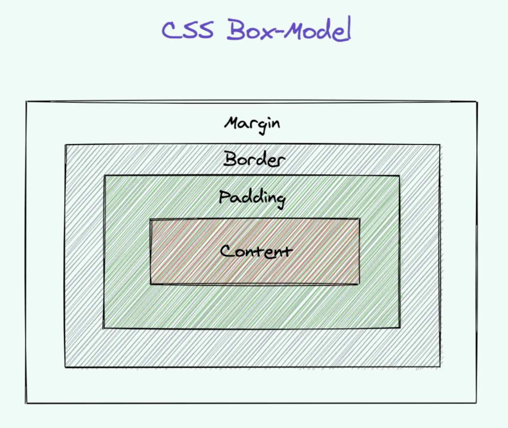
- Imagina una caja que envuelve cada elemento HTML  
    - Esto se refiere al modelo de caja  
- Tiene márgenes, bordes, rellenos y el contenido real.  
- Todo en una página web es una caja en la que se puede controlar el tamaño, la posición, el fondo, etc.
```css
div {
    width: 320px;
	padding: 10px;
	border: 5px solid gray;
	margin: 0; 
}
```

```
320px (width)

- 20px (left + right padding)
- 10px (left + right border)
- 0px (left + right margin)

= 350px
```

**La anchura total de un elemento debe calcularse así:**

```
Total element width = width + left padding + right padding + left border +
right border + left margin + right margin
```

**La altura total de un elemento debe calcularse así:**
```
Total element height = height + top padding + bottom padding + top border
+ bottom border + top margin + bottom margin
```

### <ins>Margins</ins>
- Los márgenes se utilizan para crear espacio alrededor de los elementos, fuera de su borde.

```html
<div>
  <p class="myParagraph">My Paragraph</p>
</div>
```

```css
/* styles */
.myParagraph {
  margin: 20px;
}
```

- `margin: 20px;` gives the `p` element margin of `20px` around it from all the sides

**Margin On Individual Sides**
- También puede dar margen a los elementos de cualquier lado si lo desea.
```css
margin-top
margin-right
margin-bottom
margin-left
```

**Margin Shorthands**
- Este atajo se puede utilizar para dar margen en todos los lados

```css
p{  
margin: 20px;
}
```

- El ejemplo de abajo dar margen 20px superior 
- Y dar margen 40px izquierda y derecha  

```css
p{  
margin: 20px 40px;
}
```

- El ejemplo de abajo da margen `20px` superior
- Y dar margen `40px` izquierda y derecha
- Y dar margen `50px` abajo

```css
p{  
margin: 20px 40px 50px;
}
```

**Auto Margin**
- El valor `auto` de margin establece el elemento horizontalmente centrado dentro de su contenedor  
- Abajo `div` ocupará 200px de ancho y el espacio restante se dividirá equitativamente entre el margen izquierdo y derecho
```css
div {
  width: 200px
  margin: auto;
}
```

### <ins>Paddings</ins>
- Los márgenes se utilizan para generar espacio alrededor del contenido del elemento en cuestión, dentro de su borde.

```html
<div class="myDiv">
  <p>My Paragraph</p>
</div>
```

```css
/* styles */
.myDiv {
  padding: 20px;
}
```

- `padding: 20px;` da al elemento `div` un relleno de `20px`.  
- Así que, básicamente, habrá un espacio de `20px` entre `p` y `div` en todos los lados.

**Padding On Individual Sides**
- También puede dar relleno a los elementos en cualquier lado en particular si lo desea
```css
padding-top
padding-right
padding-bottom
padding-left
```

**Padding Shorthands**
- Para acolchar todos los lados
```css
div {
  padding: 20px;
}
```

- El siguiente ejemplo da padding `20px` arriba y abajo 
- Y dar padding `40px` izquierda y derecha
- 
```css
div {
  padding: 20px 40px;
}
```

- El siguiente ejemplo da padding `20px` top 
- Y dar padding `40px` izquierda y derecha  
- Y dar padding `50px` abajo
```css
div {
  padding: 20px 40px 50px;
}
```

### <ins>Display</ins>

**Block**
- Esta propiedad estira el elemento de izquierda a derecha todo lo que puede  
- Por defecto es block para `div`, `p`, `form`, `header`, `footer`, `section` (y algunos más) 
- Estos elementos no pueden colocarse en la misma línea horizontal con ningún otro modo de visualización.  
    - Excepto cuando están floated  
- Como se muestra en la ilustración -> cada elemento se estira y ocupa toda la fila

**Inline**
- El elemento Inline se sitúa en línea  
		- Sin interrumpir el flujo de otros elementos
- Como se muestra en la ilustración -> cada elemento ocupa sólo el espacio que necesita  
    - El elemento pasa a la siguiente fila si no hay espacio suficiente
- `span`, `em`, `b` son ejemplos de elementos en línea 
- Sólo ocupan el ancho necesario  
- No respetan el relleno vertical  
    - Sin anchura  
    - Sin altura  
    - Simplemente los ignoran
- Se respetan el margen horizontal y el relleno 
- Ignoran el margen vertical y el relleno vertical

**Inline-block**
- Es igual que los elementos inline  
- PERO respetan la anchura y la altura  
- Básicamente, combinan las propiedades de los elementos de bloque y de los elementos en línea.  
- El elemento puede aparecer en la misma línea horizontal que otros elementos.  
- Así que, como muestra la ilustración, si ajustas la anchura puedes poner todos los elementos juntos en una sola fila.

**None**
- Estos elementos no aparecerán en la página en absoluto Pero todavía se puede interactuar con ella a través de DOM  
- NO hay espacio asignado en la página

**Visibility Hidden**
- Se le asigna espacio en la página 
- La etiqueta se muestra en el DOM  
- El elemento no es visible
```css
div {
  visibility: hidden;
}
```

**Flex**
- La propiedad Flex permite modificar la anchura y la altura de los elementos para adaptarlos al espacio disponible.
- Se utiliza para adaptarse a todo tipo de dispositivos de visualización y tamaños de pantalla.  
- Rellena el espacio disponible  
    - O se encoge para evitar el exceso

### <ins>Positions</ins>
**Static**
- Es el valor por defecto para cada elemento 
- Honestamente, no significa mucho.  
    - Sólo significa que se insertará en la página como lo haría normalmente.
- Como se muestra en las ilustraciones los bloques simplemente caen en su posición por defecto  
- Úsalo cuando quieras quitar la posición aplicada forzosamente al elemento 
- NOTA: `z-index` no funciona con ellos

**Relative**
- El elemento es relativo a sí mismo 
- Echa un vistazo al siguiente ejemplo
```html
<div class=myDiv""></div>
```

```css
.myDiv{
    position: relative;
    top: 10px;
    left: 10px;
}
```

- Ahora, se deslizará hacia abajo y a la izquierda por `10px` de donde normalmente sería   
    - Consulte la ilustración anterior
- Sin esa propiedad "top" - sólo habría seguido `position: static`.

**Absolute**
- Esta propiedad es muy potente  
- Le permite colocar el elemento exactamente donde desee 
- Usando top, left, bottom. y right para establecer la ubicación 
- **RECUERDE:** estos valores son relativos a su padre.  
  - Donde el padre es absoluto o relativo    
  - Si no hay tal padre, entonces se comprobará de nuevo a la etiqueta HTML y colocarlo absoluto a la propia página web
- Por lo tanto, los elementos se eliminan del "flujo" de la página web  
- No se ven afectados por otros elementos  
- Y no afecta a otros elementos  
- **NOTA:** Su uso excesivo o inadecuado puede limitar la flexibilidad de su sitio web.

```html
<div class=myDiv""></div>
```

<div class=myDiv""></div>

```css
.myDiv{
    position: absolute;
	top: 10px;
	left: 10px;
	}
```

- El `div` de arriba se deslizará hacia abajo y a la izquierda en `10px` desde su padre    
  - Asumiendo que el padre tiene una posición absoluta o relativa

**Fixed**
- Posición relativa a la ventana gráfica  
- Útil en encabezados o pies de página xed  
- Por favor, consulte la ilustración de arriba para una mejor visualización
```html
<div class=myDiv""></div>
```

```css
.myDiv{
    position: fixed;
}
```

### <ins>Centering:</ins>
- Centrar la línea de texto utilizando la propiedad `text-align`.
```html
<div class="card">
  <h2 class="">long paragraph</h2>
  <p class="">headline</p>
</div>
```

```
P { text-align: center }
H2 { text-align: center }
```

- Centrar un bloque de párrafo o una imagen usando la propiedad `margin` 
- Esto centrará horizontalmente los elementos

```html
<div class="card">
  <p class="blocktext">
    headline
  </p>
  
</div>
```

```css
P.blocktext {
    margin-left: auto;
    margin-right: auto;
    width: 50px;
}

IMG {
    display: block;
    margin-left: auto;
	margin-right: auto;
}

.card {
  border: 10px solid green;
  height: 200px;
  width: 200px;
  padding: 20px;
}
```


**Centering Vertically**
- Podemos usar la propiedad `transform` junto con `top` del elemento para centrarlo verticalmente dentro de su padre.  
- Por favor, no el contenedor padre tiene que ser posicionado `relative` o `absolute` para centrar el hijo
```html
<div class="container">
  <p>This paragraph...</p>
</div>
```

```css
div.container {
  height: 10em;
  position: relative;
  border: 2px solid blue;
}

div.container p {
  margin: 0;
  position: absolute;

  /*50% here means 50% of the height of the container
  top: 50%;*/

  /* move the element up by half its own height. '50%' in 'translate(0,
-50%)' refers to the height of the element itself */

  transform: translate(
    0,
	-50%
  );
}
```


- `top: 50%;` - aquí 50% significa el 50% de la altura del contenedor
- `transform: translate(0, -50%);`  
  - esto moverá el elemento hacia arriba la mitad de su propia altura.  
  - `50%` en `translate(0, -50%)` se refiere a la altura del propio elemento


### <ins>CSS Float</ins>
- El elemento puede desplazarse hacia la izquierda o la derecha  
- Otros elementos pueden envolverlo  
- Se utiliza para posicionar y dar formato al contenido 
- Se utiliza con imágenes y texto que se envuelve a su alrededor
```shell
left - The element floats to the left of its container
right - The element floats to the right of its container
none - The element appears in its default position
inherit - The element inherits the float value of its parent
```
```html
<p>
  my long text here...
  

</p> <p>

  my long text here...

  
</p>
```

```css
.myImage1 {
  float: left;
}

.myImage2 {
  float: right;
}
```

- Por favor, consulte el código anterior y la ilustración para obtener una mejor visualización  
- Hemos dened dos etiquetas p y una etiqueta img dentro de cada párrafo elementos 
- A continuación, establecemos float: left; en myImage1  
    - Esto empuja la imagen a la izquierda y el texto a la derecha 
- Y establecemos float: right; en myImage2  
    - Esto empuja la imagen a la derecha y el texto a la izquierda.

**Clearing Floats**
- Used to control behavior of floating elements  
- Clear is used to stop wrap of an element around a floating element 
- Floats are headache when they are not cleared properly  
- Problem1:  
    - There are 2 sections side by side  
    - You float LHS section..  
    - The LHS section height is not does not match the RHS section
		
```
============
| LHS | RHS|
|     |=====
|     |
=======
```

- Problem2:  
		- el padre se hunde cuando los hijos flotan
```
===========
parent
===========

============
| LHS | RHS|
|     |    |
============
```

```html
<div class="parent">
    <div class="lhs" >
        // float left
    </div>
    <div class="rhs">
        // float left
    </div>
</div>
```

```
// Fix:

==================
parent

============
| LHS | RHS|
|     |    |
============

===================
```

```html
<div class="parent">
    <div class="lhs" >
        // float left
    </div>
    <div class="rhs">
        // float left
</div>
    <div style="clear:both"></div>
</div>
```

**Methods to clear float:**
- claro  
    - toma 3 valores. izquierda, derecha o ambos  
    - utilizado para el problema 1
- overflow:oculto  
    - ideal para asegurar que parent no se colapse  
    - esta prop se establece en parent  
    - usado para el problema 2
- clearfix  
  - es un hack... usa pseudo elementos... y limpia ambas propiedades juntas  
  - prop fijado al padre  
  - usado para el problema 2


## Module 4 - Semantic HTML5 Module 4 - Semantic HTML5

### <ins>Semantic HTML?</ins>

- Es un estilo de codificación  
- Elementos semánticos == elementos con significado Bueno para SEO  
- Bueno para la accesibilidad  
        - Especialmente para personas con discapacidad visual  
        - Que dependen de la voz del navegador, lectores de pantalla para interpretar el contenido de la página con claridad 
        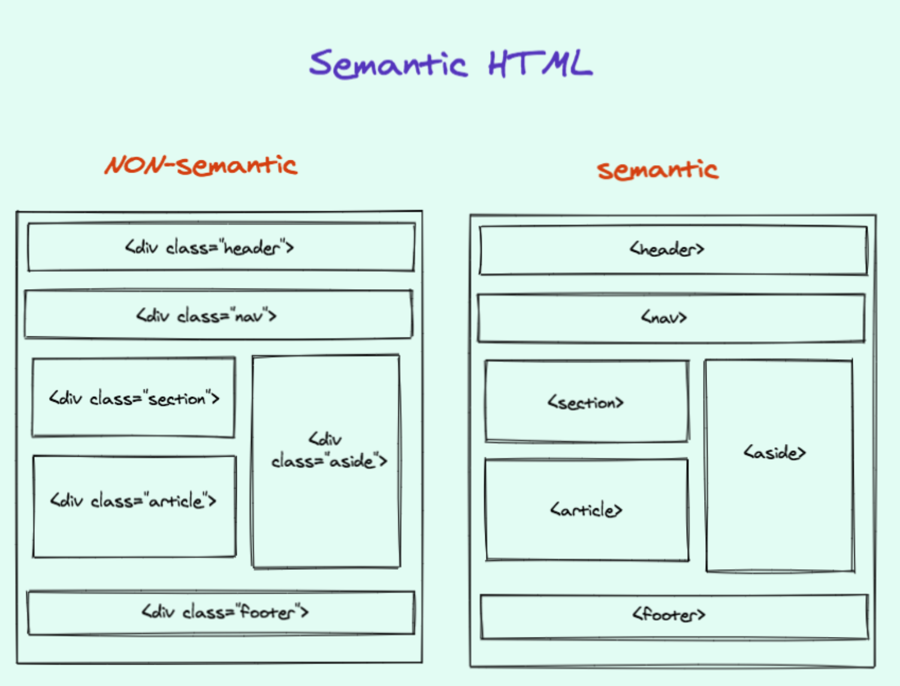
- Mira la imagen de arriba  
- Cada elemento semántico describe claramente su significado tanto al navegador como al desarrollador Evita el uso de simples etiquetas div en todas partes. No expresan claramente la intención.  
- Utilice elementos como encabezado, nav, sección, artículo, aparte, pie de página  
- Todos estos elementos están construidos con un propósito específico - también son buenos para SEO.


**More about Semantic HTML**

- `<b> </b>` para negrita, y `<i> </i>` para cursiva no debe utilizarse  
        - Son sólo formato  
        - No indican el significado ni la estructura  
- Utilice `<strong> </strong>` y `<em> </em>`  
        - Aportar significado ---> énfasis por ejemplo  
- Elementos no semánticos: `<div>` and `<span>` - No dice nada sobre su contenido   
- Elementos semánticos: `<form>`, `<table>`, and `<article>` - Define claramente su contenido

### <ins>Diference between HTML and HTML5?</ins>

**HTML**

- Lenguaje sencillo para maquetar texto e imágenes en una página web

**HTML 5**

- Más como una plataforma de desarrollo de aplicaciones  
- Un nuevo estándar para HTML  
- Mejor soporte para audio, vídeo y gráficos interactivos  
- Admite el almacenamiento de datos en línea  
- Protocolos de intercambio más robustos  
- Ya no se necesitan tecnologías de plug-in propietarias como Adobe Flash o Microsoft Silverlight.  
        - Porque los navegadores pueden procesar estos elementos sin ningún soporte externo

**Below are new semantic elements**
```html
- <article>, <aside>, <command>, <details>, <figure>, <figcaption>, <summary>
- <header>, <footer>, <hgroup>, <nav>, <progress>, <section>, <time>
- <audio> y <video>
- <canvas>
```

**What elements have disappeared in the latest HTML?**
```html
- <frame> and <frameset>
- <noframe>, <applet>, <bigcenter> and <basefront>
```

### <ins>Diference between `<div>` and `<frame>`?</ins>

- `div` es un contenedor genérico para agrupar y estilizar   
- `frame` en realidad divide la página  
- `frame` ya no es popular  
- en su lugar se utiliza `iframes`  
        - exible  
        - incrusta elementos de terceros, como vídeos de YouTube

### <ins>What is HTML5 Web Storage?</ins>

- Con HTML5, los navegadores pueden almacenar datos localmente  
- Es más seguro y rápido que las cookies  
- Puede almacenar gran cantidad de información -> más que las cookies  
- Son pares `name/value`  
- 2 objetos  
        - `window.localStorage` - almacena datos sin fecha de caducidad  
        - `window.sessionStorage` - almacena datos para una sesión (los datos se pierden cuando se cierra la pestaña)

**localStorage:**

- Almacena los datos sin fecha de caducidad   
- Los datos NO se borran al cerrar el navegador   
- Disponibles al día, semana o año siguiente
    - No es posible especificar la caducidad  
    - Puedes gestionar su caducidad en tu app

```js
// Store
localStorage.setItem("lastname", "Smith");

// Retrieve
document.getElementById("result").innerHTML =
localStorage.getItem("lastname");
```

**sessionStorage:**

- Almacena los datos para una sola sesión   
- Los datos se borran al cerrar el navegador

```js
if (sessionStorage.clickcount) {
    sessionStorage.clickcount = Number(sessionStorage.clickcount) + 1;

} else {
    sessionStorage.clickcount = 1;

}

document.getElementById("result").innerHTML = "You have clicked the button "+  
sessionStorage.clickcount + " time(s) in this session.";
```

## Module 5 - Flexbox intro and Module 5 - Flexbox intro and media query media query

### <ins>Flexbox</ins>

- Proporciona una forma eficiente de disponer, alinear y distribuir el espacio entre los elementos de un contenedor.  
- La idea principal: dar al contenedor la posibilidad de modificar la anchura/altura (y el orden) de sus elementos para aprovechar al máximo el espacio disponible.

**Flex box container properties**

- `display: flex`
    - define un contenedor flex

- `flex-direction: row | row-reverse | column | column-reverse;`
    - establece el eje principal
    - define la dirección de colocación de los niños

- `flex-wrap: nowrap | wrap | wrap-reverse;`
    - permita que los artículos se envuelvan o se desenvuelvan según sea necesario

- `justify-content`
    - define la alineación a lo largo del eje principal
    - eje X para la fila, eje Y para la columna

- `align-items`
    - define la alineación a lo largo del eje transversal
    - eje Y para fila, eje X para columna - opuesto a `justify-content`.

- children properties


**Flex box item properties**

- `order: <integer>; /* default is 0 */`
    - orden de aparición de los elementos flex en el contenedor flex

- `flex-grow: <number>; /* default 0 */`
    - define la capacidad de un elemento flexible para crecer si es necesario
    - acepta un valor sin unidades que sirve de proporción

- `flex-shrink: <number>; /* default 1 */`
    - define la capacidad de un elemento flexible para encogerse si es necesario

- `flex-basis: <length> | auto; /* default auto */`
    - define el tamaño por defecto de un elemento antes de que se distribuya el espacio restante 
    - puede ser una longitud (por ejemplo, 20%, 5rem, etc.) o una palabra clave  
    - la palabra clave `auto` significa "mira mi propiedad de anchura o altura"

- `flex: none | [ <'flex-grow'> <'flex-shrink'>? || <'flex-basis'> ]`
    - abreviatura de flex-grow, flex-shrink y flex-basis combinados  
    - por defecto 0 1 auto  
    - se recomienda utilizar esta propiedad abreviada en lugar de establecer las propiedades individuales la propiedad abreviada establece los demás valores de forma inteligente

- `align-self`
    - permite modificar la alineación por defecto de cada elemento.  
    - anula la propiedad `align-items` del contenedor

**Flexbox Examples**

- Este es el código que utilizaremos para demostrar cómo funciona flex box

```html
<div class="flex-container">
  <div class="flex-item">1</div>
  <div class="flex-item">2</div>
  <div class="flex-item">3</div>
  <div class="flex-item">4</div>
  <div class="flex-item">5</div>
  <div class="flex-item">6</div>

</div>
```

```css
.flex-container {
  display: flex;
  padding: 20px;
  margin: 0;
  list-style: none;
  background: orange;
}

.flex-item {
  background: tomato;
  padding: 5px;
  width: 200px;
  height: 150px;
  margin-top: 10px;
  line-height: 150px;
  color: white;
  font-weight: bold;
  font-size: 3em;
  text-align: center;
}
```

- Este es el resultado del código anterior
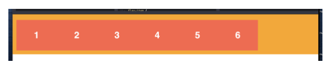    
  
    
```css
.flex-container {
  display: flex;
  flex-direction: column;
}
```
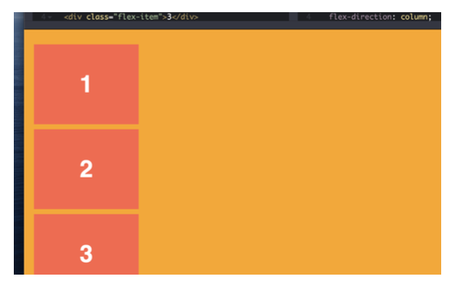

```css
.flex-container {
  display: flex;
  flex-direction: column-reverse;
}
```
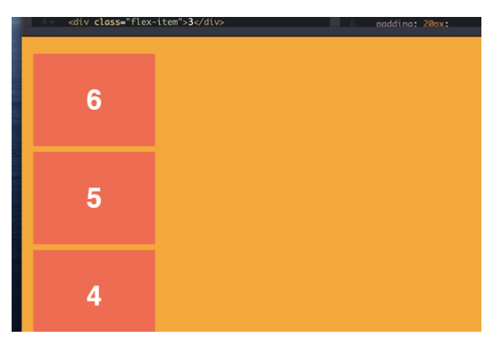

```css
.flex-container {
  display: flex;
  flex-direction: row;
  justify-content: center;
}
```

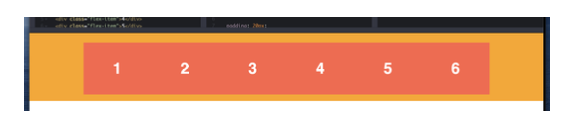

```css
.flex-container {
  display: flex;
  flex-direction: row;
  justify-content: space-between;
}
```

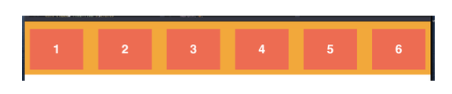

```html
<div class="flex-container">
  <div class="flex-item second">1</div>
  <div class="flex-item first">2</div>
  <div class="flex-item third">3</div>
</div>
```
```css
.first {
  order: 1;

}

.second {
  order: 2;

}

.third {
  order: 3;

}
```
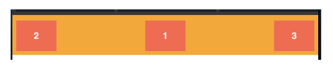  
  
```html
<div class="flex-container">
  <div class="flex-item second">1</div>
  <div class="flex-item first">2</div>
  <div class="flex-item third">3</div>
</div>
``` 
```css
.first {
  flex-grow: 1;

}

.second {
  flex-grow: 2;

}

.third {
  flex-grow: 3;

}
```

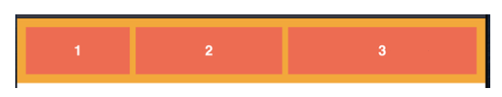

```html
<div class="flex-container">
  <div class="flex-item second">1</div>
  <div class="flex-item first">2</div>
  <div class="flex-item third">3</div>
</div>
```

```css
.first {
  flex-basis: 500px;
}
```

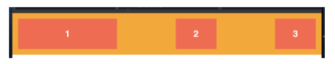


### <ins>Media queries</ins>

- Se introdujo en `CSS3`.  
- Utiliza la regla `@media` para incluir CSS sólo si se cumple una determinada condición.

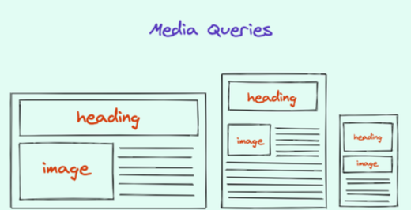  

- Las consultas de medios le permiten apuntar a cualquier plataforma que desee y escribir estilos específicos para esa plataforma.  
- Así es como se escriben los estilos responsive
    - Diferentes estilos para ordenadores de sobremesa, tabletas y móviles   
- Ejemplo sencillo

```css
// If the browser window is smaller than 500px, the background color will
change to lightblue:

@media only screen and (max-width: 500px) {
    body {

        background-color: lightblue;
    }
}
```

- A continuación se indican los puntos de ruptura para los dispositivos de su interés

```css
/* Extra small phones */
@media only screen and (max-width: 600px) {
}

/* Portrait tablets and large phones */
@media only screen and (min-width: 600px) {

}

/* Landscape tablets */
@media only screen and (min-width: 768px) {

}

/* Laptops/desktops */
@media only screen and (min-width: 992px) {

}

/* Large laptops and desktops */
@media only screen and (min-width: 1200px) {

}
```

**Always Design for Mobile First**

- Esto significa que el estilo para móviles primero  
- A continuación, incluir estilos de escritorio en las consultas de los medios de comunicación

```css
/* Default styles for mobile phones */
.mobile-styles {
    width: 100%;
}

/* Styles for desktop in media queries */
@media only screen and (min-width: 768px) {
    /* Style For desktop: */
    .desktop-styles {
        width: 100%;
    }
}
```

**Orientation: Portrait / Landscape**

- Se trata de consultas que se aplican en función de la orientación del navegador/dispositivo

```css
@media only screen and (orientation: landscape) {
    body {
        background-color: lightblue;
    }
}
```

### <ins>Let's talk about the sizes - `px` vs `em` vs `rem`</ins>

- Los `pixels` son ignorantes, evítalos
- Si estás configurando todos tus tamaños de fuente, tamaños de elementos y espaciado en píxeles, no estás tratando al usuario final con respeto.
    - Los usuarios tendrán que hacer zoom con ctrl más +/- dependiendo del dispositivo en el que se encuentren 
- Los `REMs` son una forma de establecer el tamaño de la fuente basándose en el tamaño de la fuente del elemento HTML raíz.  
- Permite escalar rápidamente todo un proyecto cambiando el tamaño de la fuente raíz.  
- `em` es relativo al tamaño de fuente de su padre directo o más cercano.
    - Cuando se tienen estilos anidados se hace difícil rastrear los ems.   
    - Esto es lo que solucionan los REM: el tamaño siempre se refiere a la raíz.
- Tanto `pixels` como `REMs` para media queries fallan en varios navegadores cuando se usa el zoom del navegador, y `EMs` es la mejor opción que tenemos.
    


**How to calculate PX from REM**    

EJEMPLO: El tamaño de la fuente HTML es de 10px, el tamaño de la fuente del párrafo es de 1,6rem.    

Entonces el tamaño en píxeles es `1.6rem * 10px = 16px`.

### <ins>More on `rem` vs `em`</ins>
- Tanto `rem` como `em` son unidades relativas  
- `rem` sólo es relativo al tamaño de fuente HTML (raíz).  
- `rem` se utiliza habitualmente para los márgenes, los rellenos y, a veces, también para el tamaño de la fuente.
- `em` es relativo al tamaño de fuente de su padre directo o más cercano.   
- se recomienda el uso de `em` para consultas de medios

### <ins>CSS Grids</ins>

**Flexbox**

- Flexbox es de 1 dimensión  
- Son columnas O filas  
- No son posibles diseños bidimensionales completos

**Grids**

- Es un sistema de maquetación basado en cuadrículas  
- Las rejillas CSS son bidimensionales  
- Se pueden modificar columnas y filas simultáneamente

> SUGERENCIA: Puede utilizar Grid y Flexbox juntos.

**Example**

- Veamos el siguiente ejemplo   
- Crea un `wrapper` DIV 
    - `display: grid;` denota el DIV como Grid   
- Luego creamos 2 filas
- Cada una tiene 2 columnas  
    - Primera columna -> 70% del espacio
    - Segunda columna -> 30% del espacio  
    - `grid-template-columns: 70% 30%;` define estas dos columnas

```html
<div class="wrapper">
    // first row
  <div>70%</div>
  <div>30%</div>

  // second row... you don't have to specify rows like bootstrap
  <div>70%</div>
  <div>30%</div>
</div>
```

```css
.wrapper {
    display: grid;

  // this will split children into 2 rows of 70% and 30%
    grid-template-columns: 70% 30%;
}
```
**Example #2 - Gaps**

- Aquí creamos 3 columnas  
    - 40% 30% 30% respectivamente  
- `grid-column-gap` - se utiliza para dar margen entre columnas  
- `grid-row-gap` - se utiliza para dar margen entre filas  
- `grid-gap` - se usa para dar margen entre filas y columnas usando un solo comando

```css
.wrapper {
    display: grid;
    grid-template-columns: 40% 30% 30%; // 3 columns in 1 row
    grid-column-gap: 1em; // margin between columns
    grid-row-gap: 1em; // margin between row
    grid-gap; 1em; // row and column both!!!
}
```
**Example #3 - Fractions**

- No tiene que perder tiempo calculando porcentajes   
- Puedes usar simplemente "fracciones"  
- 3 DIVS con el mismo ancho
```css
grid-template-columns: 1fr 1fr 1fr;
```  

- 3 DIVS
- El espacio total se dividirá por 4
    - ej: 80 / 4 = 20px  
    - 1er y 3er DIV ocuparán un espacio de 20px  
    - El 2º DIV ocupará 40px

```css
grid-template-columns: 1fr 2fr 1fr;
```

**Example #4 - Fractions Contd.**

- Puede utilizar la función repeat() en lugar de repetir manualmente los tamaños de las columnas   
- La siguiente propiedad creará 4 columnas  
- El ancho de cada columna es 1fr
```css
grid-template-columns: repeat(4, 1fr);
```
> SUGERENCIA: se recomiendan las fracciones antes que los píxeles o los %.

- Ejemplo ampliado
```css
.wrapper {
  display: grid;

  // 3 columns in 1 row
  // divide into fractions...
  grid-template-columns: 1fr 2fr 1fr;

  // it will repeat fractions 4 times
  grid-template-columns: repeat(4, 1fr 2fr);

  grid-auto-row: 100px; // row height will be 100px

  grid-auto-row: minmax(100px, auto); // min height = 100px max height =
auto based on content
}
```
**Nested grids**

- También puede definir rejillas anidadas

```html
<div class="wrapper">
  <div class="nested">

    <div></div>
    <div></div>
    <div></div>

  </div>
</div>
```

```css
// now the nested div is also a grid container
.nested {

    display: grid;
  grid-template-columns: repeat(3, 1fr); // 3 columns of 1 fr
  grid-auto-rows: 100px;

}

Start-End points of Grid

}
```

- También podemos especificar los puntos inicial y final de las columnas y filas de la cuadrícula 
- Si utiliza esta opción, es posible que no desee especificar los tamaños  
- Echa un vistazo a las descripciones en línea
```html
// wrapper is grid container... of 4 columns in this example!!!
<div class="wrapper">

  <div class="box1"></div>
  <div class="box2"></div>
  <div class="box3"></div>
  <div class="box4"></div>

</div>
```

```css
.box1 {
    grid-column: 1/3; // box1 spans from 1 to 3 columns on browser window

  grid-row: 1/3; // box1 spans from 1 to 3 rows on browser window
}

.box2 {
    grid-column: 3; // box2 spans takes spaces 3 and 4

  grid-row: 1/3; // same as box1
}

.box3 {
    grid-column: 2/4; // box3 will take space 2 to 4

  grid-row: 3; // it will take row space 3
}

// NOTE: in grids... we can overlaps things.. like below
// overlaps 1 and 3
// Sooo... you don't need negative margins and that crap CSS!!!
.box4 {

    grid-column: 1;
  grid-row: 2/4;

}
```

## Module 6 - Quirks, tips, and Module

### <ins>FOUC</ins>  
- Flash de contenido sin estilo
- Ocurre cuando durante un breve momento -> el contenido se muestra con los estilos por defecto del navegador   
- Ocurre cuando no se carga el CSS pero sí el contenido  

**¿Cómo evitarlo?**    

1.
- Puedes usar CSS para ocultar BODY
- Luego, cuando CSS se carga a continuación, utilizando JS -> establecer el cuerpo a visible   
- Pero ten en cuenta que si JS está desactivado -> ¡¡¡los usuarios no verán nada nunca!!!

  
2.
- Usar JS para ocultar el cuerpo
- Y cuando JS y CSS estén cargados -> usar JS sólo para hacer visible el cuerpo 
- Escriba el código JS en HEAD -> para que tan pronto como se pulse, el HTML se oculte. 
- Y cuando el documento esté listo -> entonces mostrar el HTML de nuevo

```html
 <html>
    <head>
        <!— Other stuff like title and meta tags go here -->
        <style type="text/css">
            .hidden {display:none;}
        </style>
        <script type="text/javascript" src="/scripts/jquery.js"></script>
        <script type="text/javascript">
            $('html').addClass('hidden');
            $(document).ready(function() { // EDIT: From Adam Zerner's
comment below: Rather use   load: $(window).on('load', function () {...});
                $('html').show(); // EDIT: Can also use
$('html').removeClass('hidden');
            });
        </script>
    </head>
    <body>
        <!— Body Content -->
    </body>
</html>
```
### <ins>BEM naming convention</ins>  
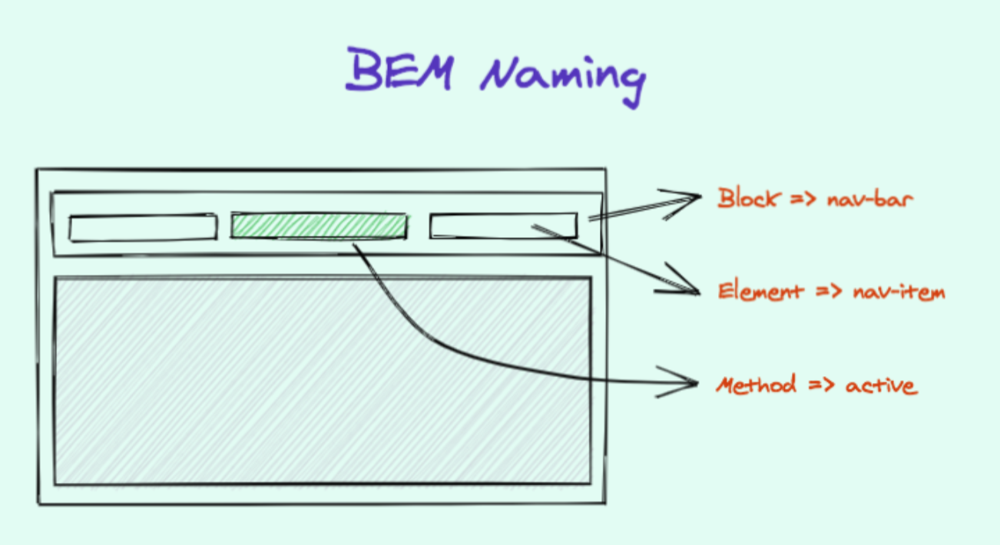  

- Blocks, Elements, Modifiers -> BEM
- Convención de nombres para escribir estilos de forma que todos los miembros de su equipo entiendan la convención   
- Blocks
  - Representa una entidad independiente que tiene sentido por sí misma
  - Elementos de nivel superior
  - Sólo selector de nombre de clase
  - Sin nombre de etiqueta ni id
  - `<ul class="nav"></ul>`  
- Elements  
  - Hijos de componentes de nivel superior
  - No suelen tener un significado independiente 
  - Cualquier nodo DOM dentro de un bloque puede ser un elemento 
  - Sólo selector de nombre de clase
  - Sin nombre de etiqueta ni ids
  - `<li class="nav__item"></li>`
  - 2 guiones bajos -> indica que el elemento es hijo de nav  

- Modifiers  
    - Utilízalos para cambiar la apariencia, el comportamiento o el estado
    - Puedes añadirlos a bloques o elementos
    - Mantenga los estilos originales de "bloque" o "elemento" tal cual - añada una nueva clase modificadora
    - Ej a continuación - separar elemento de clase`nav__item` y separar modificador de clase `nav__item—-active`
    - `<li class="nav__item nav__item—-active"></li>`
    - 2 guiones -> indica que `active` es una clase modificadora  

```css
<ul class="nav">
  <li class="nav__item">Home</li>
  <li class="nav__item nav__item—-active">About</li> // active modifier applied
</ul>
```
### <ins>OOCSS - Object Oriented CSS</ins>  

- Estándar para estructurar su CSS de forma modular   
- Puede reutilizar CSS sin problemas
  - Significa que el CSS de NAV se puede utilizar en cualquier contenedor -> section, page, dialog   
- Sigue un enfoque basado en componentes
- Permite abstraer estilos comunes
    - Reduce la duplicación de los estilos  

```css
 // basic example
.global {
  width: 980px;
  margin: 0 auto;
  padding-left: 20px;
  padding-right: 20px;
}
.header {
  height: 260px;
}
.main {
  background-color: gray;
}
.footer {
  height: 100px;
  background-color: blue;
}
```

```html
  <header>
  <div class="header global">
    // your code
  </div>
</header>
<div class="main global">
  // your code
</div>
<footer>
  <div class="footer global">
    // your code
  </div>
</footer>
```

### <ins>CSS User Agent Styles</ins>

- Estos son los estilos del navegador
- Cuando el navegador renderiza una página aplica estilos básicos antes de que hayas escrito un solo estilo   
- Cada navegador tiene sus estilos específicos diferentes de otros navegadores
    - Esto causa un problema de inconsistencia   
- Para resolver este problema
    - Normalizar CSS y Restablecer CSS   
    - Normalizar CSS como solución suave
    - Restablecer CSS como solución más agresiva

### <ins>Normalizing CSS</ins>  

- Small CSS file that provides cross-browser consistency
- Provides default styles for HTML elements
- Make sure that all HTML elements renders the same way in ALL browsers - same padding, margin, border, etc..
- In some cases this approach applies IE or EDGE styles to the rest of the browsers  


### <ins>Reset CSS</ins>  

- This approach says that we don’t need the browsers’ default styles at all   
- We’ll define in the project according to our needs
- `CSS Reset` resets all of the styles that come with the browser’s user agent   
- Grab sample CSS reset [here](https://meyerweb.com/eric/tools/css/reset/)
- The problem with CSS Resets is that they are ugly and hard to debug
- Solution - use Normalize CSS with little bit of CSS Reset
- Unlike an ordinary CSS reset, target specic HTML tags’ styles rather than making a big list of tags.
    - Make it less aggressive and a lot more readable  

### <ins>Validate your CSS</ins>

- Use online tools to validate your CSS
- Validation Service can be used to check the correctness (validity)
- You might get important insights on what you are missing
- It Helps Cross-Browser, Cross-Platform and Future Compatibility
- Validating your web page does not ensure that it will appear the way you want it to.
    - It merely ensures that your code is without HTML or CSS errors. 
- Tool - The Validation Service

### <ins>Testing Strategies</ins>

- Do cross-browser testing
- Manually test Chrome, Firefox
- Then manually test IE, Edge
- Then use tools like ..for compatibilities
     - browsershots.org
     - IEtest  

### <ins>Conditional CSS</ins>  

- Use below conditional CSS for IE hacks

 ```html 
<link type="text/css" href="style.css" />
<!—[If IE]>
  <link type="text/css" href="IEHacks.css" />
<![endif]-->
<!—[if !IE]>
  <link type="text/css" href="NonIEHacks.css" />
<![endif]-->
```