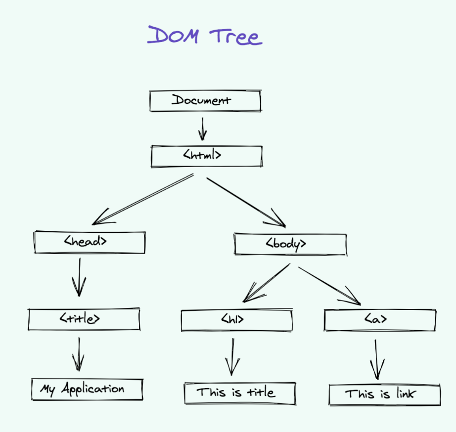

## Module 1 - Getting Started  

### <ins>Crea tu primera página HTML</ins>

- Crea una carpeta `app` en tu ordenador  
- Crea una página llamada `index.html` dentro de la carpeta `app` en tu ordenador Abre esa página en tu editor de texto favorito
	- Yo personalmente uso VSCode

### <ins>Escriba el siguiente código `boilerplate` en el archivo `index.html`</ins>

- Este es su código HTML boilerplate  
- Le está diciendo al navegador que index.html es un archivo HTML y que lo renderice como un sitio web HTML. 
- La etiqueta `head` es donde se declaran los metadatos, el título y se enlazan los archivos de estilo.  
- La etiqueta `body` es donde se empieza a escribir el código de la página web.
	- La parte visible del documento HTML se encuentra entre `<body>` y `</body>`. 
- La etiqueta `title` se utiliza para dar título a la página.
- La etiqueta `h1` se utiliza para mostrar un título en la página.

```html
<!DOCTYPE html>
<html>

  <head>
    <title>My First HTML Page</title>

  </head>
  <body>

    <h1>My First Web Page</h1>
  </body>

</html>
```


### <ins>Ejecute su primer archivo HTML</ins>

- Para ejecutar su aplicación localmente   
    - Guarde los cambios en la página `index.html`.  
    - A continuación, abra implícitamente su archivo `index.html` en el navegador

### <ins>Ejecutar la aplicación en Internet GRATIS</ins>

- Si quieres ejecutar tu aplicación en Internet y compartir la URL con tu socio sigue estos pasos  
- Ve a [Netlify Drop](https://app.netlify.com/drop)
- Suelta la carpeta que contiene tu HTML y CSS le (si tienes una) en esa página donde dice `Arrastra y suelta la carpeta de tu sitio aquí`.
- Y ¡voilá! Se creará una URL única que podrás compartir con tu socio.

> Puedes ver el ejemplo [aquí](https://happy-ramanujan-9ca090.netlify.app)

**¡Si no escribo `<! DOCTYPE html>` ¿funcionará HTML5?**

- No, el navegador no podrá identificar que se trata de un documento HTML y las etiquetas HTML 5 no funcionarán correctamente.  
- Los navegadores modernos son lo suficientemente inteligentes como para renderizar el contenido HTML, pero puede que no esté optimizado correctamente.

**DOM**

- El documento HTML se representa como un árbol 
- Cada nodo del árbol es un objeto  
- El objeto `document` representa el árbol DOM
- El nodo `<html>` está en la raíz
- `<head>` y `<body>` son sus hijos
- Los nodos hoja contienen el texto del documento  
- "My Application", "This is title", y "This is link" son los nodos hoja.  
- La api DOM está disponible para capturar eventos de usuario y dar acceso a sus hijos

> NOTA: Si ponemos algo después de la etiqueta final `</body>`, entonces eso se mueve automáticamente dentro del cuerpo, al final, ya que la especificación HTML requiere que todo el contenido debe estar dentro de `<body>`.

> NOTA: Los navegadores modernos son inteligentes. Si el navegador encuentra HTML malformado, lo corrige automáticamente al hacer el DOM. Por ejemplo: el navegador insertará automáticamente la etiqueta `<html>` en la parte superior si no se proporciona.

### <ins>When should you use section, div or article?</ins>

**section**
+ Agrupar contenidos con un único tema relacionado 
+ Como una subsección de un artículo largo 
+ Normalmente tiene encabezamiento y pie de página
```html
<section>
	<h2>Subtitle</h2>
	<p>My long paragraph</p>
</section>
```
**article**
- Representa el contenido completo y autónomo de una página. 
- Puede ser una entrada de foro, un artículo de periódico, una entrada de blog 
- Su contenido independiente  
- Tiene sentido por sí mismo
```html
<article>
	<h2>Subtitle</h2>
	<p>My long paragraph</p>
</article>
```

**div**
- No transmite ningún significado  
- Suele denominarse elemento de último recurso 
- Se utiliza cuando ningún otro elemento es adecuado
```html 
<div>
  <h2>Subtitle</h2>
  <p>My long paragraph</p>
</div>
```
**Headings**
- Las etiquetas Heading forman parte del HTML semántico  
- Se utilizan para dene encabezados  
- Van de `h1` a `h6`  
- El tamaño por defecto es el mayor para `h1` y el menor para `h6`
```html
<h1>My Heading 1</h1>
<h2>My Heading 2</h2>
<h3>My Heading 3</h3>
<h4>My Heading 4</h4>
<h5>My Heading 5</h5>
<h6>My Heading 6</h6>
```

- Los encabezados se utilizan con fines de SEO  
    - Optimización para motores de búsqueda  
    - Útiles para indexar páginas y la estructura de la página  
- Puede dar formato a los estilos de fuente según sus necesidades para estas etiquetas

```html 
<h1 style="font-size:72px;">My Heading</h1>
```

**Paragraph**
- El elemento `p` se utiliza para escribir un párrafo de texto en HTML.  
- Puede incluir p dentro de otros elementos como div, section, article

> CONSEJO: no añada espacios en blanco adicionales - el navegador eliminará los espacios y líneas sobrantes cuando se muestre la página. Utiliza otras propiedades HTML y CSS para añadir espacios en blanco según tus necesidades.

```html
<div>
  <p style="font-size:12px;">This is a paragraph.</p>
</div>
```

**Links / Anchor elements**
- Los enlaces permiten a los usuarios navegar  
    - De una página a otra 
    - O incluso de una sección de la página a otra sección de la misma página 
- Los enlaces en HTML se denominan Hiperenlaces  
- El siguiente enlace le llevará a `https://www.google.com`.
- El atributo `href` especifica la dirección de destino

```html
<a href="https://www.google.com">Google</a>
```

**Images**
- HTML le permite añadir imágenes en su sitio web  
- El atributo `src` es donde se especifica la ubicación de la imagen. 
    - Puede ser una imagen de Internet  
    - O de su máquina local

```html

```

- La etiqueta `img` también contiene otro atributo llamado `alt`.  
- Los atributos `alt` permiten mostrar un texto alternativo en caso de que la imagen no esté disponible para su visualización.  
    - Por ejemplo, si no hay conexión a Internet o el usuario utiliza un lector de pantalla.

**Image Sizes**
- Puedes ajustar el tamaño de tu imagen utilizando las propiedades `width` y `height` o la propiedad style

```html 


```

**Image as Links**
- Puede hacer que las imágenes sean clicables utilizando etiquetas `anchor` a su alrededor.  
- Esto se puede utilizar para navegar a otro lugar haciendo clic en la imagen

```html
<a href="https://www.google.com">
	
</a>
```


