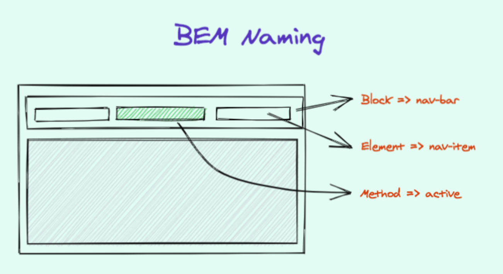

## Module 6 - Quirks, tips, and Module

### <ins>FOUC</ins>  
- Flash de contenido sin estilo
- Ocurre cuando durante un breve momento -> el contenido se muestra con los estilos por defecto del navegador   
- Ocurre cuando no se carga el CSS pero sí el contenido  

**¿Cómo evitarlo?**    

1.
- Puedes usar CSS para ocultar BODY
- Luego, cuando CSS se carga a continuación, utilizando JS -> establecer el cuerpo a visible   
- Pero ten en cuenta que si JS está desactivado -> ¡¡¡los usuarios no verán nada nunca!!!

  
2.
- Usar JS para ocultar el cuerpo
- Y cuando JS y CSS estén cargados -> usar JS sólo para hacer visible el cuerpo 
- Escriba el código JS en HEAD -> para que tan pronto como se pulse, el HTML se oculte. 
- Y cuando el documento esté listo -> entonces mostrar el HTML de nuevo

```html
 <html>
    <head>
         <!-- Other stuff like title and meta tags go here  -->
        <style type="text/css">
            .hidden {display:none;}
        </style>
        <script type="text/javascript" src="/scripts/jquery.js"></script>
        <script type="text/javascript">
            $('html').addClass('hidden');
            $(document).ready(function() { // EDIT: From Adam Zerner's
comment below: Rather use   load: $(window).on('load', function () {...});
                $('html').show(); // EDIT: Can also use
$('html').removeClass('hidden');
            });
        </script>
    </head>
    <body>
         <!-- Body Content  -->
    </body>
</html>
```
### <ins>BEM naming convention</ins>  
  

- Blocks, Elements, Modifiers -> BEM
- Convención de nombres para escribir estilos de forma que todos los miembros de su equipo entiendan la convención   
- Blocks
  - Representa una entidad independiente que tiene sentido por sí misma
  - Elementos de nivel superior
  - Sólo selector de nombre de clase
  - Sin nombre de etiqueta ni id
  - `<ul class="nav"></ul>`  
- Elements  
  - Hijos de componentes de nivel superior
  - No suelen tener un significado independiente 
  - Cualquier nodo DOM dentro de un bloque puede ser un elemento 
  - Sólo selector de nombre de clase
  - Sin nombre de etiqueta ni ids
  - `<li class="nav__item"></li>`
  - 2 guiones bajos -> indica que el elemento es hijo de nav  

- Modifiers  
    - Utilízalos para cambiar la apariencia, el comportamiento o el estado
    - Puedes añadirlos a bloques o elementos
    - Mantenga los estilos originales de "bloque" o "elemento" tal cual - añada una nueva clase modificadora
    - Ej a continuación - separar elemento de clase`nav__item` y separar modificador de clase `nav__item—-active`
    - `<li class="nav__item nav__item—-active"></li>`
    - 2 guiones -> indica que `active` es una clase modificadora  

```css
<ul class="nav">
  <li class="nav__item">Home</li>
  <li class="nav__item nav__item—-active">About</li> // active modifier applied
</ul>
```
### <ins>OOCSS - Object Oriented CSS</ins>  

- Estándar para estructurar su CSS de forma modular   
- Puede reutilizar CSS sin problemas
  - Significa que el CSS de NAV se puede utilizar en cualquier contenedor -> section, page, dialog   
- Sigue un enfoque basado en componentes
- Permite abstraer estilos comunes
    - Reduce la duplicación de los estilos  

```css
 // basic example
.global {
  width: 980px;
  margin: 0 auto;
  padding-left: 20px;
  padding-right: 20px;
}
.header {
  height: 260px;
}
.main {
  background-color: gray;
}
.footer {
  height: 100px;
  background-color: blue;
}
```

```html
  <header>
  <div class="header global">
    // your code
  </div>
</header>
<div class="main global">
  // your code
</div>
<footer>
  <div class="footer global">
    // your code
  </div>
</footer>
```

### <ins>CSS User Agent Styles</ins>

- Estos son los estilos del navegador
- Cuando el navegador renderiza una página aplica estilos básicos antes de que hayas escrito un solo estilo   
- Cada navegador tiene sus estilos específicos diferentes de otros navegadores
    - Esto causa un problema de inconsistencia   
- Para resolver este problema
    - Normalizar CSS y Restablecer CSS   
    - Normalizar CSS como solución suave
    - Restablecer CSS como solución más agresiva

### <ins>Normalizing CSS</ins>  

- Small CSS file that provides cross-browser consistency
- Provides default styles for HTML elements
- Make sure that all HTML elements renders the same way in ALL browsers - same padding, margin, border, etc..
- In some cases this approach applies IE or EDGE styles to the rest of the browsers  


### <ins>Reset CSS</ins>  

- This approach says that we don’t need the browsers’ default styles at all   
- We’ll define in the project according to our needs
- `CSS Reset` resets all of the styles that come with the browser’s user agent   
- Grab sample CSS reset [here](https://meyerweb.com/eric/tools/css/reset/)
- The problem with CSS Resets is that they are ugly and hard to debug
- Solution - use Normalize CSS with little bit of CSS Reset
- Unlike an ordinary CSS reset, target specific HTML tags’ styles rather than making a big list of tags.
    - Make it less aggressive and a lot more readable  

### <ins>Validate your CSS</ins>

- Use online tools to validate your CSS
- Validation Service can be used to check the correctness (validity)
- You might get important insights on what you are missing
- It Helps Cross-Browser, Cross-Platform and Future Compatibility
- Validating your web page does not ensure that it will appear the way you want it to.
    - It merely ensures that your code is without HTML or CSS errors. 
- Tool - The Validation Service

### <ins>Testing Strategies</ins>

- Do cross-browser testing
- Manually test Chrome, Firefox
- Then manually test IE, Edge
- Then use tools like ..for compatibilities
     - browsershots.org
     - IEtest  

### <ins>Conditional CSS</ins>  

- Use below conditional CSS for IE hacks

 ```html 
<link type="text/css" href="style.css" />
<!-- [If IE] -->
  <link type="text/css" href="IEHacks.css" />
<!-- [endif] -->
<!-- [if !IE] -->
  <link type="text/css" href="NonIEHacks.css" />
<!-- [endif] -->
```